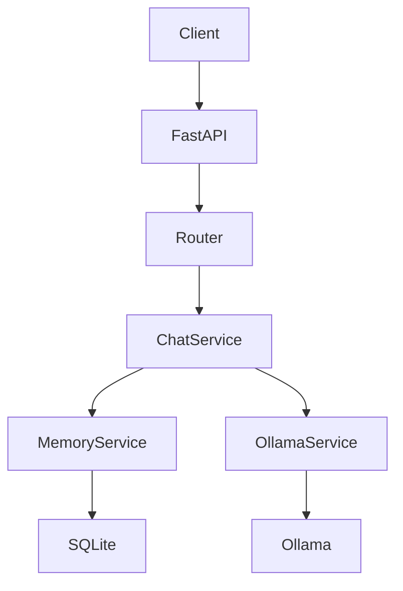

# 🤖 AI Assistant Backend


A professional AI Assistant Backend built with **FastAPI**, **Ollama**, **SQLAlchemy**, and **Docker**.

The project provides a RESTful API for interacting with a local Large Language Model (LLM) while maintaining conversation history using SQLite.

The main goal of this project is demonstrating a clean backend architecture suitable for AI-powered applications.

---

# ✨ Features

- FastAPI REST API
- Local LLM integration using Ollama
- Conversation history management
- Multi-session chat support
- SQLite database storage
- SQLAlchemy ORM
- Service-oriented architecture
- Environment-based configuration
- Centralized logging
- Health monitoring endpoint
- Docker and Docker Compose support
- Automated API testing with Pytest
- Swagger API documentation

---

# 🏗️ Architecture

The project follows a layered backend architecture:



## Layers

### Router Layer

Responsible for:

- Receiving HTTP requests
- Validating input
- Returning API responses

Location:

```
app/routers/
```

---

### Service Layer

Contains the main business logic.

Responsibilities:

- Managing chat flow
- Communicating with Ollama
- Managing conversation memory

Location:

```
app/services/
```

---

### Database Layer

Responsible for:

- Database connection
- ORM models
- CRUD operations

Technology:

- SQLite
- SQLAlchemy

Location:

```
app/database/
app/models/
```

---

# 📂 Project Structure

```
ai-assistant/

│
├── app/
│
│   ├── core/
│   │   ├── config.py
│   │   └── logger.py
│
│   ├── database/
│   │   ├── database.py
│   │   └── crud.py
│
│   ├── models/
│   │   └── message.py
│
│   ├── routers/
│   │   ├── chat.py
│   │   └── health.py
│
│   ├── schemas/
│   │   └── chat.py
│
│   ├── services/
│   │   ├── chat_service.py
│   │   ├── memory_service.py
│   │   └── ollama_service.py
│
│   └── version.py
│
├── tests/
│
├── Dockerfile
├── docker-compose.yml
├── requirements.txt
├── requirements-dev.txt
├── main.py
└── README.md
```

---

# ⚙️ Requirements

Before running the project, install:

- Python 3.13+
- Ollama
- Docker (optional)

---

# 🚀 Running Locally

## 1. Clone Repository

```bash
git clone https://github.com/MahdiZeim/ai-assistant-backend.git

cd ai-assistant-backend
```

---

## 2. Create Virtual Environment

```bash
python -m venv .venv
```

Activate:

Windows:

```bash
.venv\Scripts\activate
```

Linux:

```bash
source .venv/bin/activate
```

---

## 3. Install Dependencies

Production:

```bash
pip install -r requirements.txt
```

Development:

```bash
pip install -r requirements-dev.txt
```

---

# 🧠 Ollama Setup

Install Ollama and download the required model:

```bash
ollama pull llama3.2:1b
```

Run Ollama:

```bash
ollama serve
```

---

# 🔐 Environment Variables

Create a `.env` file:

```env
OLLAMA_MODEL=llama3.2:1b
OLLAMA_HOST=http://127.0.0.1:11434
```

---

# ▶️ Run Application

Start FastAPI:

```bash
python -m uvicorn main:app --reload
```

Application:

```
http://127.0.0.1:8000
```

Swagger Documentation:

```
http://127.0.0.1:8000/docs
```

---

# 🐳 Docker

Build container:

```bash
docker compose build
```

Run:

```bash
docker compose up
```

The API will be available at:

```
http://127.0.0.1:8000
```

---

# 📡 API Endpoints

## Root

### GET `/`

Response:

```json
{
    "status": "AI Assistant is running 🚀"
}
```

---

## Health Check

### GET `/health`

Checks:

- Application status
- Database connection
- Ollama configuration

---

## Chat

### POST `/chat/`

Send a message to the AI assistant.

Request:

```json
{
    "session_id": "user-1",
    "message": "Hello"
}
```

Response:

```json
{
    "user_message": "Hello",
    "ai_response": "Hello! How can I help you?"
}
```

---

# 🧪 Testing

Run tests:

```bash
pytest
```

Example:

```
=====================
1 passed
=====================
```

---

# 🛠 Technologies

| Technology | Purpose |
|---|---|
| Python | Programming Language |
| FastAPI | Backend Framework |
| Ollama | Local LLM Runtime |
| SQLAlchemy | ORM |
| SQLite | Database |
| Docker | Containerization |
| Pytest | Testing |

---

# 🛣 Roadmap

## v1.1

- GitHub Actions CI/CD
- Improved monitoring

## v1.2

- JWT Authentication
- User management

## v1.3

- PostgreSQL support
- Database migrations with Alembic

## v2.0

- RAG implementation
- Vector database integration
- Document based conversations

---

# 📄 License

This project is released under the MIT License.

---

# 👨‍💻 Author

Developed as a backend AI engineering portfolio project.